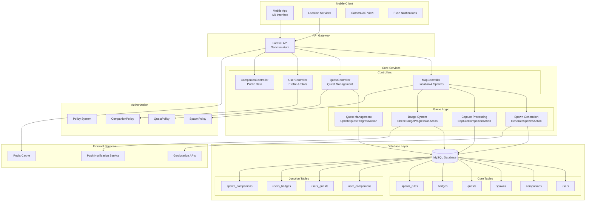
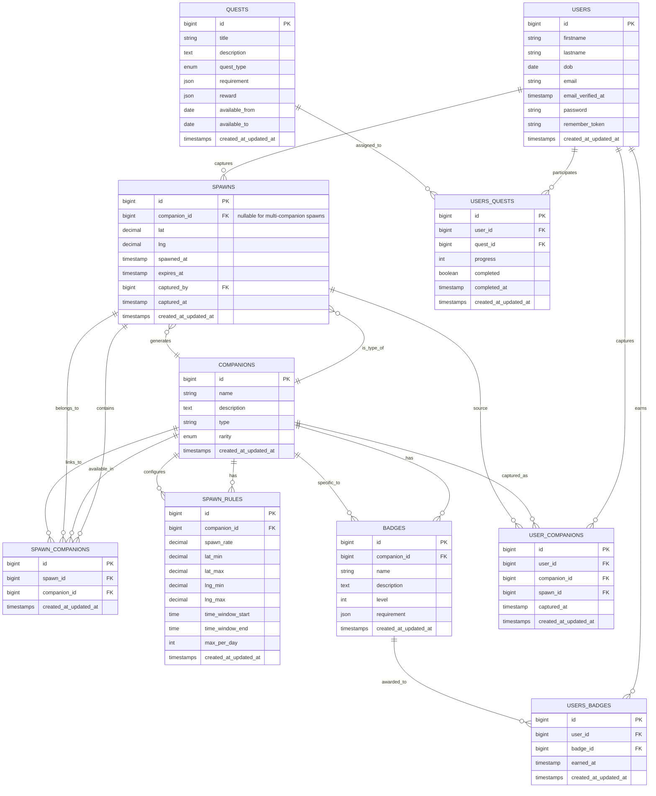
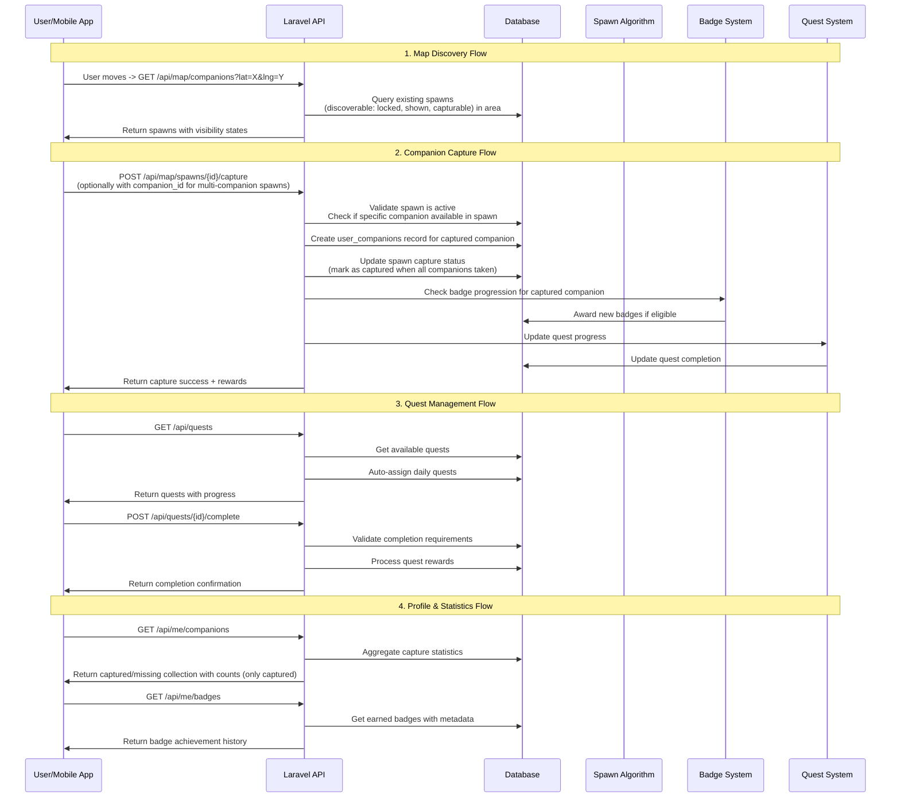
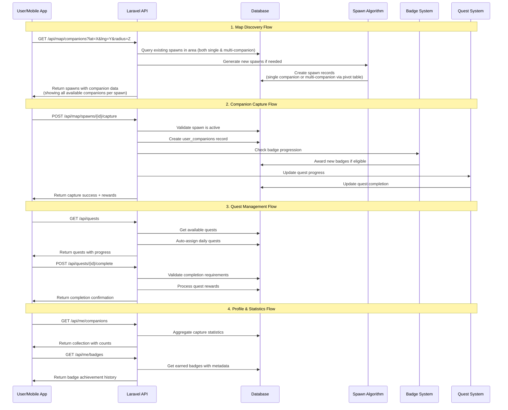
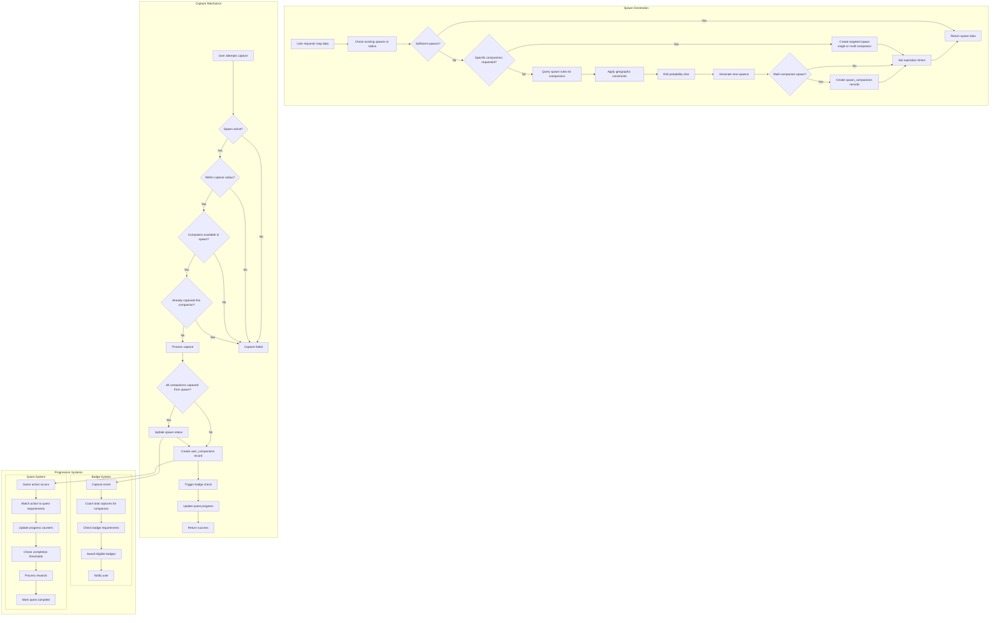
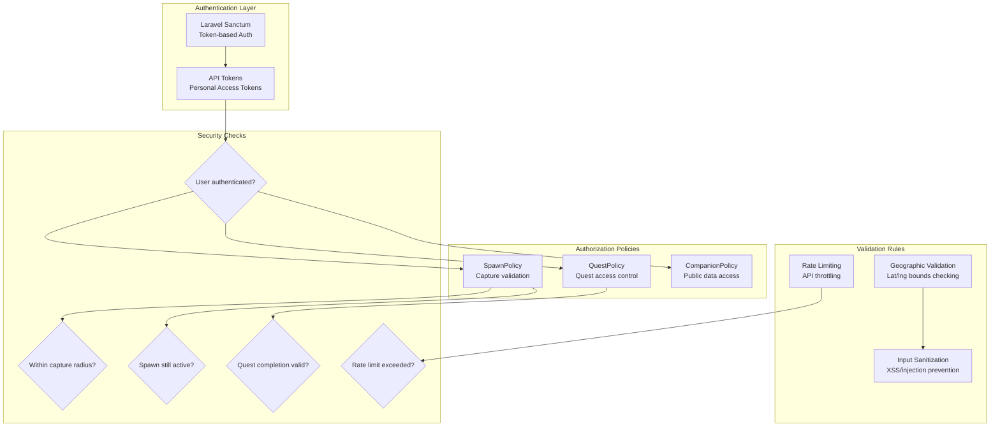
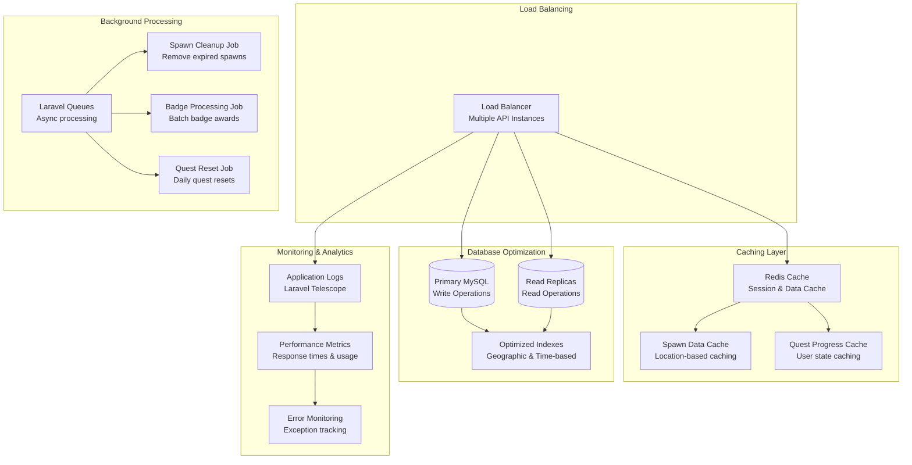
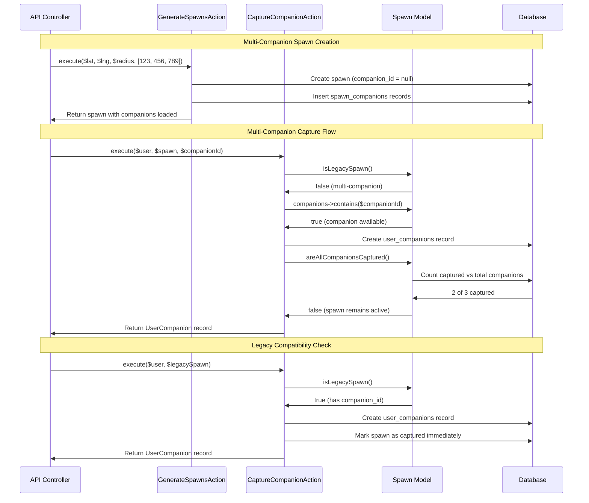

# 🎮 PnutGo System Architecture Diagram

This document contains comprehensive system diagrams for the PnutGo AR location-based companion collection game.

## 🏗️ System Architecture Overview



## 🗄️ Database Entity Relationship Diagram



## 🎮 Game Flow Diagram

### Modified





## 🔄 Core Game Mechanics



## 🔌 API Architecture

```mermaid
graph LR
    subgraph "Public APIs"
        PUB1[GET /api/companions<br/>List all companions]
        PUB2[GET /api/companions/{id}<br/>Companion details]
    end

    subgraph "Authenticated APIs"
        subgraph "Map & Location"
            MAP1[GET /api/map/companions<br/>Location-based spawns<br/>Shows single & multi-companion spawns]
            MAP2[POST /api/map/spawns/{id}/capture<br/>Capture companion<br/>Optional: companion_id for multi-companion spawns]
        end
        
        subgraph "Quest Management" 
            QUEST1[GET /api/quests<br/>Active quests with progress]
            QUEST2[POST /api/quests/{id}/complete<br/>Complete quest]
        end
        
        subgraph "User Profile"
            USER1[GET /api/me<br/>Profile with statistics]
            USER2[GET /api/me/badges<br/>Achievement history]
            USER3[GET /api/me/companions<br/>Collection with counts]
        end
        
        subgraph "Authentication"
            AUTH1[POST /auth/login<br/>Sanctum token auth]
            AUTH2[GET /auth/me<br/>Current user]
            AUTH3[POST /auth/logout<br/>Revoke token]
        end
    end

    subgraph "Request Validation"
        VAL1[MapCompanionsRequest<br/>Lat/lng/radius validation]
        VAL2[Form Requests<br/>Input sanitization]
    end

    subgraph "Response Resources"
        RES1[CompanionResource<br/>Companion data formatting]
        RES2[MapSpawnResource<br/>Spawn with visibility state]
        RES3[QuestResource<br/>Quest with progress data]
        RES4[BadgeResource<br/>Badge with earn timestamp]
        RES5[UserCompanionCollectionResource<br/>Collection statistics]
    end

    MAP1 --> VAL1
    MAP2 --> VAL1
    
    PUB1 --> RES1
    PUB2 --> RES1
    MAP1 --> RES2
    QUEST1 --> RES3
    USER2 --> RES4
    USER3 --> RES5
```

## 🛡️ Security & Authorization



## 🚀 Scaling Architecture



## 📊 Data Flow Summary

### Key Features Implemented:
- **Location-based spawn system** with dynamic generation
- **Multi-companion spawn support** with backward compatibility
- **Companion collection** with rarity-based spawning
- **Quest system** with daily/event-based tasks
- **Badge progression** with capture milestone tracking
- **Real-time map interface** with visibility states
- **User progression tracking** with comprehensive statistics
- **Policy-based authorization** for secure game mechanics
- **Comprehensive API** with proper JsonResource formatting
- **Flexible capture mechanics** supporting companion selection

### Technical Highlights:
- **Laravel 12** with Sanctum authentication
- **MySQL database** with optimized relationships
- **Action-based architecture** for business logic
- **Policy-driven authorization** for security
- **Comprehensive test coverage** with Pest framework
- **Geographic calculations** for spawn mechanics
- **JSON-based requirement/reward system** for flexibility

This architecture supports the core gameplay loop of discovery → capture → progression while maintaining scalability for millions of users.

---

## 🎯 Multi-Companion Spawn Architecture

### Enhanced Spawn System Design

```mermaid
graph TB
    subgraph "Spawn Creation Logic"
        SC1[GenerateSpawnsAction]
        SC2{Companion IDs provided?}
        SC3[Legacy spawn generation<br/>uses spawn rules]
        SC4{Single or multiple companions?}
        SC5[Create single companion spawn<br/>set companion_id]
        SC6[Create multi-companion spawn<br/>companion_id = null]
        SC7[Create spawn_companions records<br/>via pivot table]
        
        SC1 --> SC2
        SC2 -->|No| SC3
        SC2 -->|Yes| SC4
        SC4 -->|Single| SC5
        SC4 -->|Multiple| SC6
        SC6 --> SC7
    end

    subgraph "Capture Processing Logic"
        CP1[CaptureCompanionAction]
        CP2{Legacy spawn?}
        CP3[Capture single companion<br/>from companion_id]
        CP4{Companion ID specified?}
        CP5[Validate companion in spawn<br/>via spawn_companions]
        CP6[Capture specified companion]
        CP7[Capture first available companion]
        CP8{All companions captured?}
        CP9[Mark spawn as captured]
        CP10[Leave spawn active]
        
        CP1 --> CP2
        CP2 -->|Yes| CP3
        CP2 -->|No| CP4
        CP4 -->|Yes| CP5
        CP4 -->|No| CP7
        CP5 --> CP6
        CP6 --> CP8
        CP7 --> CP8
        CP8 -->|Yes| CP9
        CP8 -->|No| CP10
    end

    subgraph "Database Architecture"
        subgraph "Legacy Support"
            LS1[spawns.companion_id<br/>nullable field]
            LS2[Direct companion relationship<br/>for backward compatibility]
        end
        
        subgraph "Multi-Companion Support"
            MS1[spawn_companions table<br/>pivot relationship]
            MS2[Many-to-many relationship<br/>spawns ↔ companions]
            MS3[Unique constraint<br/>spawn_id + companion_id]
        end
        
        subgraph "Unified Access"
            UA1[getAllCompanions() method<br/>returns Collection]
            UA2[isLegacySpawn() method<br/>type detection]
            UA3[hasMultipleCompanions() method<br/>count check]
        end
    end

    SC7 --> MS1
    CP5 --> MS2
    CP6 --> UA1
```

### Data Flow Patterns



### Key Implementation Benefits

#### 🔄 **Backward Compatibility**
- Existing single companion spawns continue to work unchanged
- No migration required for existing data
- Gradual adoption of multi-companion features

#### 🎮 **Enhanced Gameplay**
- Players can choose which companion to capture from multi-companion spawns
- Spawns remain active until all companions are captured
- More strategic gameplay decisions

#### 🏗️ **Technical Flexibility**
- Hybrid approach supports both spawn types
- Unified model interface (`getAllCompanions()`)
- Clear separation of concerns between single and multi-companion logic

#### 📊 **Data Integrity**
- Foreign key constraints ensure referential integrity
- Unique constraints prevent duplicate spawn-companion pairs
- Proper indexing for efficient queries

### Migration Strategy

1. **Phase 1**: Database schema changes (completed)
   - Add `spawn_companions` table
   - Make `companion_id` nullable in `spawns`

2. **Phase 2**: Model enhancements (completed)
   - Add relationships and helper methods
   - Update actions to support both spawn types

3. **Phase 3**: API enhancements (ready)
   - Optional `companion_id` parameter in capture endpoint
   - Enhanced spawn resources showing all companions

4. **Phase 4**: Client updates (future)
   - UI for companion selection in multi-companion spawns
   - Visual indicators for spawn types

This enhanced architecture maintains the simplicity of the original system while adding powerful new capabilities for richer gameplay experiences.
